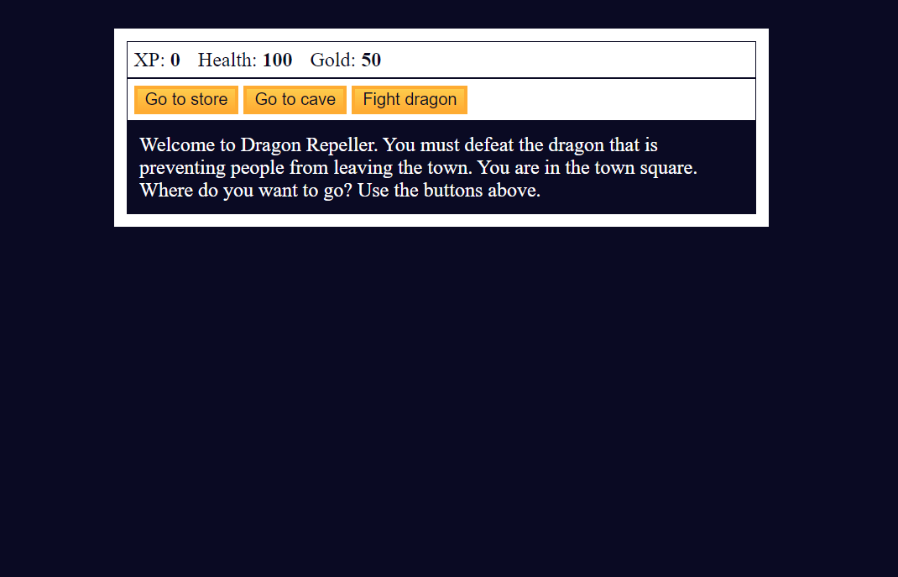

# rolePlayingGame

## Overview

Welcome to the Adventure RPG Game! Embark on a journey, face monsters, buy weapons, and explore different locations in this simple text-based RPG.

## Player Stats

- **XP:** 0
- **Health:** 100
- **Gold:** 50
- **Current Weapon:** Stick
- **Inventory:** Stick

## Gameplay

1. **Go to different locations:**

   - Town Square
   - Store
   - Cave
   - Fight Dragon

2. **Interact in Locations:**

   - Buy health or weapons in the store.
   - Fight monsters in the cave.

3. **Fight Monsters:**

   - Choose from actions like Attack, Dodge, or Run.
   - Your success depends on your weapon and monster's level.

4. **Win or Lose:**

   - Gain gold and XP for defeating monsters.
   - Lose health when attacked or make wrong choices.

5. **Easter Egg:**

   - Discover a secret game with a chance to win gold or lose health.

6. **Restart the Game:**
   - Replay the game and improve your strategy.

## Controls

- **Buttons:**
  - Button 1: Perform the first action.
  - Button 2: Perform the second action.
  - Button 3: Perform the third action.

## Locations

1. **Town Square:**

   - Visit the store, cave, or fight a dragon.

2. **Store:**

   - Buy health or upgrade your weapon.

3. **Cave:**

   - Fight different monsters for rewards.

4. **Fight:**

   - Choose actions to combat the monster.

5. **Kill Monster:**

   - Gain rewards and return to the town square.

6. **Lose:**

   - Game Over - Restart to try again.

7. **Win:**

   - Congratulations! You defeated the dragon and won the game.

8. **Easter Egg:**
   - Secret game with a chance to win or lose.

## Technologies Used

- HTML
- JavaScript

## App

